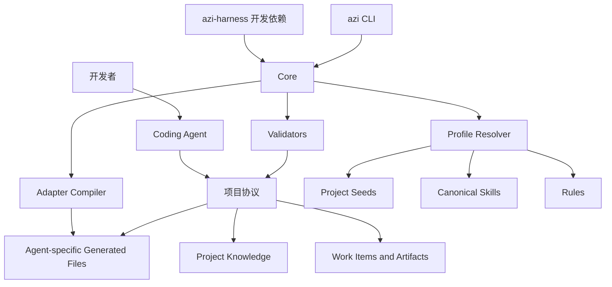

# 总体架构

## 逻辑架构



## 物理边界

首版使用单 npm 包，避免提前引入 monorepo 发布复杂度，但代码必须保持以下模块边界：

```text
azi-harness/
├─ src/
│  ├─ core/
│  ├─ profiles/
│  ├─ skills/
│  ├─ adapters/
│  ├─ validators/
│  └─ cli/
├─ profiles/
├─ schemas/
└─ templates/
```

当 Adapter、Profile 或 Registry 需要独立发布时，再拆分为 workspace 包。

## 运行边界

### 包管理器负责

- 安装和锁定 `azi-harness` 版本。
- 下载依赖及验证 npm 完整性。
- 团队成员和 CI 使用一致版本。

### AZI Core 负责

- 读取项目配置。
- 解析 Profile 和 Skill 契约。
- 计算期望文件。
- 生成 Adapter 文件。
- 预览冲突和执行同步。
- 运行结构与产物校验。

### Coding Agent 负责

- 读取项目协议和真实代码。
- 按 Skill 执行研发工作。
- 生成或更新工作实例产物。
- 在权限范围内修改代码和执行工具。

### 人类负责

- 产品决策、架构取舍和风险接受。
- 批准高风险或外部副作用操作。
- Review 最终交付并对业务结果负责。

## 数据流

```text
node_modules/azi-harness 中的 Profile
            +
项目 .azi/config.json
            +
项目维护的 Agent Docs / Rules
            ↓
        Adapter 编译
            ↓
.codex/skills 等托管生成文件
            ↓
      Coding Agent 执行
            ↓
docs/agent/work/<work-id>/ 交付产物
```

## 关键约束

- Core 不能依赖某个模型供应商。
- Adapter 只能改变格式和目标位置，不能偷偷改变业务规则。
- Profile 不能在安装时执行任意脚本。
- Project Knowledge 不能被 `sync` 自动覆盖。
- CLI 所有写入操作必须支持 `--dry-run` 或等价预览。
- 无 Adapter 时，Core 协议仍应可由通用 Agent 手动读取。
