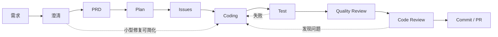

# 工作实例与 SDD 流程

## 为什么需要 Work Item

单一 `.state.json` 无法处理多个并行需求，也不能表达真实证据。AZI 使用每个需求独立的
Work Item，将状态、产物、批准和阻塞项放在同一边界中。

## 目录

```text
docs/agent/work/FEAT-2026-001-order-list/
├─ work.json
├─ requirement.md
├─ ui-contract.md
├─ prd.md
├─ plan.md
├─ issues/
│  ├─ 01-data-contract.md
│  └─ 02-order-list-ui.md
├─ test-report.md
├─ quality-review.md
└─ code-review.md
```

只有实际需要的文件才创建，不要求每个任务机械地产生全部文档。

## 推荐流程



## 流程不是僵硬状态机

- 普通功能应该走完整流程。
- 明确、低风险的小修复可以合并 PRD、Plan 和 Issue，但必须保留验收与测试证据。
- 研究任务可以只产生调查报告和建议。
- 紧急修复可以先缩短流程，但必须记录原因和补偿性 Review。
- Validator 检查所需证据，不根据一个全局数字机械放行。

## Artifact 状态

每个 Artifact 可以是：

- `missing`
- `draft`
- `review-required`
- `approved`
- `rejected`
- `superseded`

Work Item 的整体状态只用于概览：

- `draft`
- `active`
- `blocked`
- `ready-for-review`
- `completed`
- `abandoned`

## 审批记录

批准记录必须包括：

- 批准的 Artifact 或操作。
- 批准人标识。
- 时间。
- 结论。
- 可选备注。

首版允许由 Agent 写入用户在当前会话中的明确批准，但不得伪造身份或推断批准。

## 最低证据

进入交付前至少需要：

- 可观察的验收标准。
- 变更范围说明。
- 实际执行的测试或无法执行的原因。
- 未解决风险。
- Review 结果。

任何 Skill 都不得把“建议运行”记录为“已经通过”。
