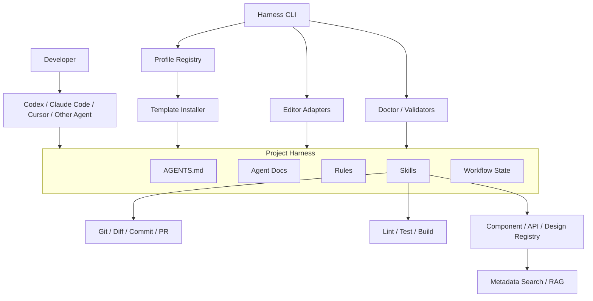

# Zerone-AI-Coding 原理、架构与复刻路线

## 1. 先说结论

Zerone-AI-Coding 不是一个新的大模型，也不只是普通代码生成脚手架。根据文章和截图，
它更接近一套面向研发团队的 **AI Coding Harness**：

> 把团队的需求流程、项目知识、编码规则、角色权限、质量门禁和可复用技能，
> 以文件和命令的形式安装进真实项目，让不同 AI 编程工具按同一套工程约束工作。

基础版本的核心并不神秘：

1. CLI 把一组模板安装到项目。
2. AI 编辑器读取这些项目级文件。
3. Skills 将复杂研发流程拆成可独立触发的步骤。
4. Rules 和文档限制 AI 的行为边界。
5. 工作流门禁确保 Agent 不从模糊需求直接跳到写代码。
6. 更高级版本再连接企业组件库、接口库、设计系统和知识检索服务。

这也是为什么它可以宣称“不限 AI 编辑器”：模型和编辑器是执行环境，Zerone 提供的是
执行协议与企业上下文。

## 2. 已确认事实与架构推断

### 材料明确披露的事实

- 套件名为 `oh-my-zerone`，截图版本为 `v1.2.0`。
- CLI 包名为 `@zerone/cli`。
- 安装后执行 `zerone setup omz`。
- 首次初始化使用 `/setup-omz`。
- 它以 SDD（规格驱动开发）为优先原则。
- 它不绑定单一 AI 编辑器。
- 核心组成是 `AGENTS.md`、Agent Docs、Rules、Skills。
- 工作流覆盖需求、计划、PRD、Issue、编码、测试、质检、Review、Commit/PR。
- 强调 AFK/HITL，即 Agent 可自主执行，但关键环节保留人工审批。
- 企业级能力包括组件复用、接口生成、知识沉淀和新人问答。

### 根据常见 Harness 实现作出的推断

- `@zerone/cli` 很可能发布在企业私有 npm Registry，因此公共 npm 返回 404。
- `zerone setup omz` 中的 `omz` 应是一个可安装 Profile 或套件 ID。
- CLI 主要负责下载、复制、升级、校验和适配文件，而不是自己完成所有 AI 推理。
- `/setup-omz`、`/to-plan` 等应是 AI 编辑器加载 Skill 后暴露的 Slash Command。
- Skills 本质上大概率是 Markdown/YAML 指令、模板和辅助脚本的组合。
- 企业组件推荐能力需要额外的组件元数据、搜索索引或 RAG 服务，基础文件套件本身不够。

由于源码闭源，以上推断不能视为其内部源码的精确复现，但这是实现同类产品最合理、
成本最低的工程方案。

## 3. 用户实际如何使用

### 安装层

```bash
npm install -g azi-harness
azi-harness setup frontend-team
```

CLI 从本地包或 Registry 找到 `frontend-team` Profile，将它安装到当前项目。

### 初始化层

项目中出现：

```text
AGENTS.md
docs/agent/
rules/
skills/
.harness/
```

用户在支持 Skill 的 AI 编辑器中运行：

```text
/setup-project
/to-prd
/to-plan
/to-issues
/to-coding
/to-test
/to-quality-review
/to-review
/to-commit
```

### 执行层

当用户提出“做一个订单列表页面”时，Agent 不应立即修改代码，而是：

1. 读取 `AGENTS.md`，确认职责、权限和必读文档。
2. 用 `/to-locate` 找到路由、组件库、请求封装和类似页面。
3. 用 `/to-prd` 把模糊需求结构化为验收标准。
4. 用 `/to-plan` 生成改动计划和风险。
5. 用 `/to-issues` 拆成可验证任务。
6. 用 `/to-coding` 按任务实现。
7. 用 `/to-test` 执行测试。
8. 用 `/to-quality-review` 检查规范、可访问性和安全。
9. 用 `/to-review` 审查 diff。
10. 用 `/to-commit` 整理提交与 PR。

## 4. 四个核心构件

### AGENTS.md

它是项目级 Agent 入口，相当于 AI 的 `CONTRIBUTING.md`。

应包含：

- 项目目标和术语
- Agent 的职责
- 允许和禁止的操作
- 必读文档
- 工作流入口
- 人工审批点
- 可用 Skills

它应该短而稳定，不要把全部知识都堆进去。

### Agent Docs

用于存放较长、变化频率不同的项目知识：

```text
docs/agent/
├─ instruction.md
├─ architecture.md
├─ workflow.md
├─ permission.md
├─ review.md
├─ design-system.md
├─ api-conventions.md
└─ evolution.md
```

这样 Agent 可以按任务加载相关内容，减少上下文消耗。

### Rules

Rules 是不可轻易违反的全局约束，例如：

- 只能使用 Vue 3 Composition API。
- 页面必须复用公司组件库。
- HTTP 请求必须走 `src/utils/request.ts`。
- 禁止直接修改生成代码。
- 新增页面必须有路由权限、加载态、空态和错误态。
- 禁止在日志、Prompt 或源码中写入密钥。

规则必须具体、可检查。类似“写高质量代码”这种口号没有约束力。

### Skills

Skill 是可独立触发、可组合、具有明确输入和输出的工作单元。

一个 Skill 至少应定义：

```yaml
name: to-test
description: Run risk-based verification for the active implementation.
inputs:
  - active issue
  - changed files
outputs:
  - commands executed
  - results
  - residual risks
```

Skill 正文再描述进入条件、步骤、退出条件和失败处理。

## 5. 推荐的整体架构



### 第一层：CLI Shell

负责命令解析和用户交互：

```text
azi-harness setup <profile>
azi-harness update
azi-harness doctor
azi-harness status
azi-harness skill list
azi-harness adapter add codex
```

### 第二层：Profile 与模板系统

Profile 是一套可版本化的团队配置：

```text
profiles/frontend-team/
├─ profile.json
├─ AGENTS.md
├─ docs/
├─ rules/
├─ skills/
└─ adapters/
```

不同团队可以有 Vue、React、Node、Java 等 Profile。

### 第三层：编辑器适配器

统一内容需要映射到不同工具的约定：

```text
core protocol
├─ Codex adapter
├─ Claude Code adapter
├─ Cursor adapter
└─ generic adapter
```

适配器只负责格式和安装位置，不应复制业务规则。

### 第四层：工作流引擎

使用有限状态机约束阶段：

```text
discovery
-> planning
-> prd
-> issues
-> coding
-> testing
-> quality-review
-> review
-> commit-pr
```

状态可以保存在 `.harness/state.json`。复杂版本可以为每个 Issue 单独保存状态。

### 第五层：验证与质量门禁

CLI 不只是复制 Markdown，还应该验证：

- 必需文件是否存在
- PRD 是否包含验收标准和非目标
- Issue 是否可独立验证
- 实现后是否有测试证据
- Review 是否处理了高优先级问题
- Git 工作区是否包含越界修改
- Commit/PR 是否关联需求和测试

### 第六层：企业资产与知识服务

这是文章“三阶段演进”中后两阶段的关键：

```text
企业组件
-> 元数据清单
-> 文档与示例
-> 搜索索引
-> Agent 检索
-> 推荐复用
-> 审核后回写资产库
```

仅把组件源码塞进 Prompt 不够。需要为每个资产建立机器可读描述：

```json
{
  "name": "DataTable",
  "package": "@company/ui",
  "version": "3.2.0",
  "framework": "vue",
  "useCases": ["列表", "分页", "排序", "批量操作"],
  "props": ["columns", "data", "loading"],
  "examples": ["docs/examples/data-table-basic.vue"],
  "constraints": ["禁止直接修改内部 DOM"],
  "owner": "frontend-platform"
}
```

早期可以用 JSON + 全文搜索；资产量大后再增加向量检索和权限过滤。

## 6. 推荐代码结构

```text
azi-harness/
├─ packages/
│  ├─ cli/                 # 命令入口
│  ├─ core/                # 配置、状态机、安装器、验证器
│  ├─ profile-schema/      # Profile 与 Skill Schema
│  ├─ adapter-codex/
│  ├─ adapter-claude/
│  ├─ adapter-cursor/
│  ├─ registry-client/     # 可选远程 Registry
│  └─ asset-indexer/       # 组件/API/文档索引
├─ profiles/
│  ├─ core/
│  └─ frontend-vue/
├─ tests/
└─ docs/
```

作为前端开发者，首版无需直接做成 monorepo。一个 Node.js 包即可，等适配器和 Profile
数量增加后再拆包。

## 7. 推荐技术栈

### 首版

- Node.js 20+
- TypeScript
- `commander` 或 `cac`：命令解析
- `prompts`：交互式初始化
- `picocolors`：终端颜色
- `fs-extra`：文件安装
- `zod`：配置和产物校验
- `yaml`：Skill/Profile 清单
- Node `test` 或 Vitest：测试

### 后续

- `execa`：安全执行 lint/test/git
- `simple-git`：Git 状态和 diff
- `globby`：文件发现
- SQLite：本地资产索引
- Orama 或 MiniSearch：本地全文搜索
- 企业场景再考虑向量数据库和远程知识服务

不要一开始就加入 LangChain、向量数据库和复杂 Agent Runtime。第一阶段的核心价值来自
规范、模板、流程和验证，不来自基础设施规模。

## 8. 从零实现的四个阶段

### 阶段 A：本地 Harness MVP

目标：证明项目规则可以稳定约束 Agent。

实现：

- `init/setup`
- `AGENTS.md`
- Agent Docs
- Rules
- 8 至 10 个核心 Skills
- `doctor/status/advance`
- 默认不覆盖已有文件

验收：在两个真实项目中，让同一个需求经过完整流程，比较生成代码的一致性。

### 阶段 B：多编辑器适配

目标：同一套团队协议可用于不同 AI 工具。

实现：

- 通用 Profile
- Codex、Claude Code、Cursor 适配器
- 差异预览
- 可回滚更新

验收：同一 Skill 在三种工具中具有相近输入、输出和门禁。

### 阶段 C：工程门禁

目标：从“提示 AI”升级为“机器检查”。

实现：

- PRD/Issue Schema
- lint/test/build 执行器
- Git diff 范围检查
- Review 清单
- Commit/PR 生成器

验收：缺少验收标准、测试失败或存在越权改动时，流程不能正常进入下一阶段。

### 阶段 D：企业资产复用

目标：让 Agent 优先使用企业组件、接口和代码模板。

实现：

- 组件/API 元数据规范
- 文档采集器
- 本地或远程搜索
- 权限过滤
- 推荐与引用证据
- 审核后资产回写

验收：常见页面需求能稳定复用已有组件，而不是重新生成替代实现。

## 9. 你作为前端开发者的学习顺序

1. Node.js CLI：参数、文件系统、进程退出码。
2. Markdown/YAML 配置协议设计。
3. 模板安装和安全升级。
4. 有限状态机。
5. JSON Schema/Zod 验证。
6. Git diff、lint、test、build 集成。
7. 不同 AI 编辑器的项目指令与 Skill 约定。
8. 组件元数据和搜索。
9. 最后才是 RAG、向量检索和远程服务。

你不需要先成为大模型工程师。第一版 80% 是常规前端工程化知识：Node、配置、模板、
规范、测试和工具链。

## 10. 最容易踩的坑

- **把它做成 Prompt 大合集**：没有输入输出契约和验证，规则很快失效。
- **所有知识塞入 AGENTS.md**：上下文过大，Agent 反而抓不住重点。
- **Skill 职责重叠**：`to-plan`、`to-prd`、`to-issues` 必须有清晰边界。
- **强绑定某个编辑器**：核心协议与适配器应分离。
- **自动覆盖项目文件**：安装和升级必须提供 diff、备份或回滚。
- **直接信任远程 Skill**：需要版本锁定、校验和来源审计。
- **只统计生成速度**：还要统计返工率、缺陷率、复用率和 Review 通过率。
- **把宣传数据当基线**：截图中的 25% 至 70% 属于厂商案例结果，缺少样本、测量口径和
  对照实验，不能直接作为你的产品承诺。

## 11. 当前 MVP 与目标架构的对应关系

当前目录中的 `azi-harness` 已经实现：

- 零依赖 Node.js CLI
- `init/setup/doctor/status/advance/skills`
- `AGENTS.md + docs/agent + rules + skills`
- 工作流状态机
- 默认不覆盖已有文件
- 基础测试

它对应阶段 A 的骨架。下一步最有价值的不是接模型 API，而是：

1. 增加 Profile Schema。
2. 增加 Codex/Claude/Cursor 适配器。
3. 为 PRD、Issue、Test Report 定义结构化格式和验证器。
4. 在一个真实 Vue 项目中跑通端到端流程。
